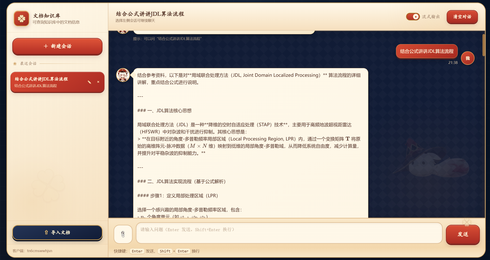
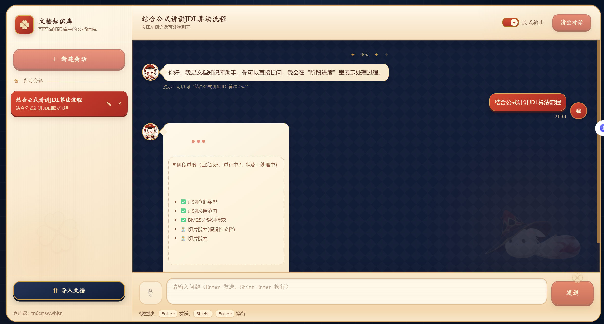
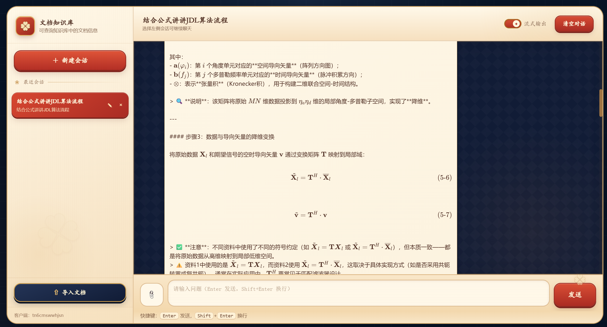
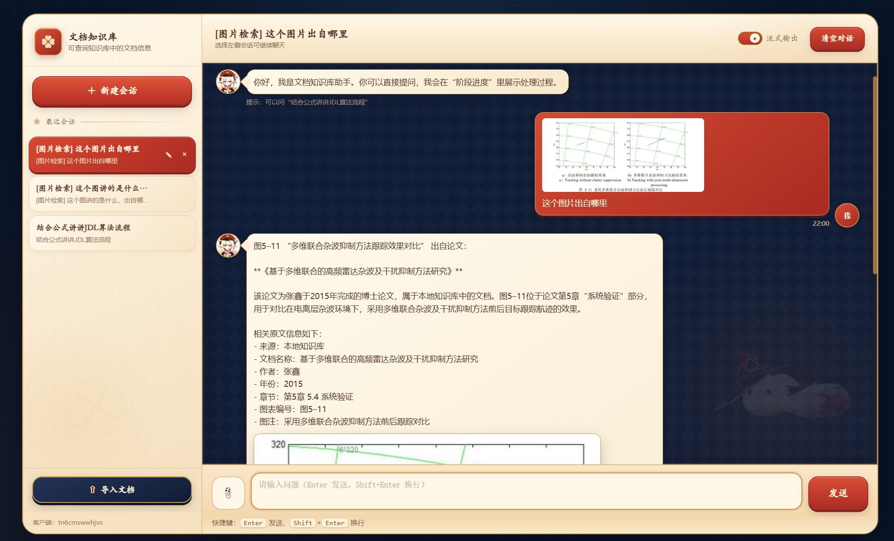
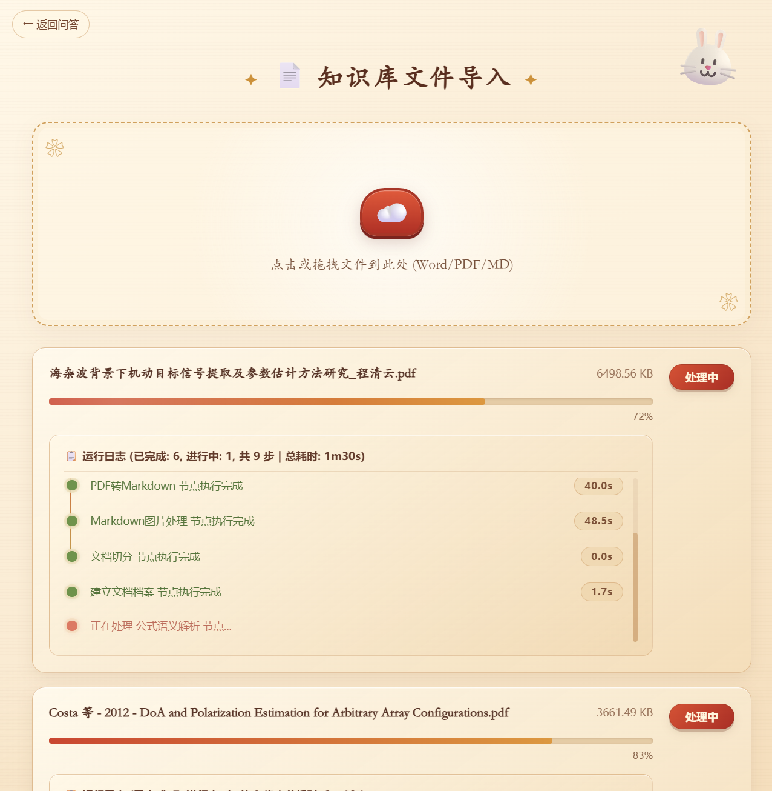
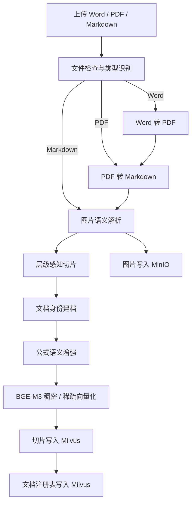
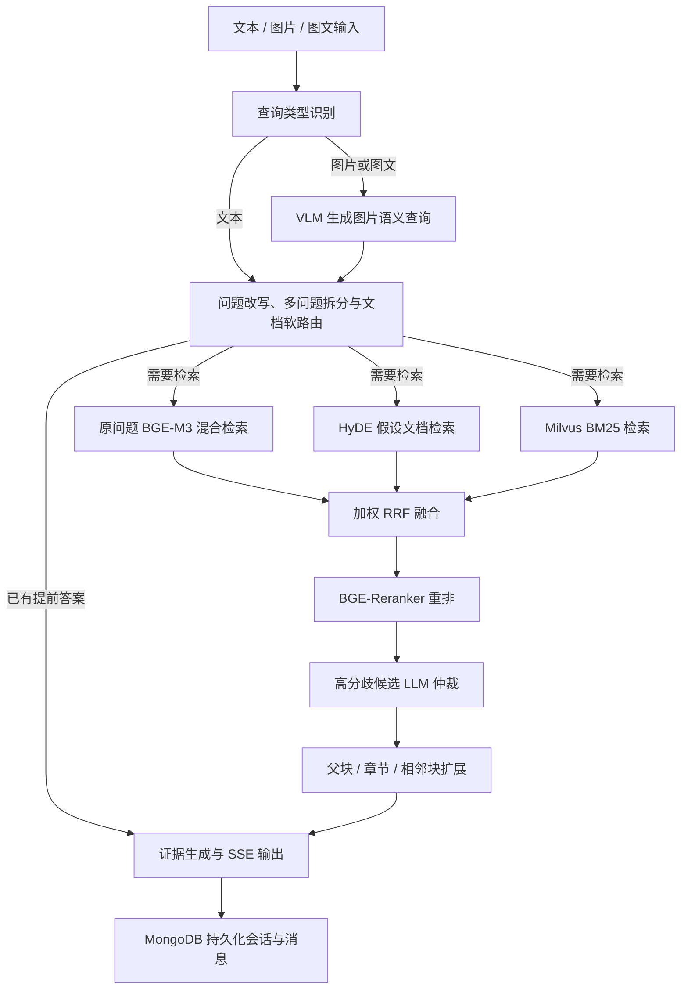

# 科研文档智能知识库问答系统

基于 **LangGraph + RAG** 构建的科研文档知识库，面向中英文论文、学位论文与技术报告，覆盖文档解析、层级切片、多模态语义增强、文档路由、多路召回、融合重排和流式多轮问答。

项目重点不是简单的“向量检索 + LLM”，而是围绕科研文档中常见的长章节、复杂公式、图文混排、文档重名与比较类问题，设计完整的入库和查询双 Workflow。

> 本仓库提供代码和本地运行说明，不提供在线演示。默认接入 MinerU 与 DashScope API，仅应处理公开或已获授权的资料；敏感文档需要替换为内网部署的解析、LLM 和 VLM 服务。

## 效果预览

### 流式知识问答

回答会根据检索证据增量输出，并保留公式、章节结构与上下文信息。

<p align="center">
  
</p>

### 查询过程可视化

前端通过 SSE 展示查询类型识别、文档路由、BM25、HyDE、向量检索、融合与重排等阶段，便于观察链路进度和定位耗时节点。

<p align="center">
  
</p>

### 公式与图片溯源

回答支持 KaTeX 公式渲染，也可以根据用户上传的图片定位原始论文、章节和图号。

<p align="center">
  
</p>

<p align="center">
  
</p>

### 文档入库进度

文档处理作为后台任务运行，页面实时展示解析、图片处理、切片、建档、公式增强、向量化与入库状态。

<p align="center">
  
</p>

## 核心能力

- **双 Workflow 编排**：使用 LangGraph 分别组织文档入库和知识查询流程，各节点职责独立，支持条件路由与并行检索。
- **科研文档解析**：支持 Word、PDF 和 Markdown；保留 Markdown 标题层级、表格、代码块、行内公式和块级 LaTeX 公式。
- **多模态语义增强**：结合图片所属章节与前后文生成图片摘要，支持文本、图片及图文混合查询。
- **公式语义增强**：补充公式变量、单位、含义与适用条件；通过低信息量公式过滤、跨切片去重、批处理和并发降低调用开销。
- **层级感知切片**：按照 Markdown 标题树切片，长块递归拆分、同父标题短块合并，保留文档、章节、父块与相邻块关系。
- **文档身份建档**：维护规范标题、别名、主题和 `doc_id`，解决文件名不稳定、同名文档和用户简称带来的路由问题。
- **Hard / Soft / Global 文档路由**：唯一命中时限定文档，多候选时软加权，低置信度时回退全库，避免主题硬门控造成漏召回。
- **三路检索**：并行执行原问题 BGE-M3 稠密/稀疏混合检索、HyDE 假设文档检索和 Milvus BM25 关键词检索。
- **融合与重排**：通过加权 RRF 合并多路候选，再使用 BGE-Reranker 精排；对 RRF 与 Reranker 强分歧的边界候选进行选择性 LLM 仲裁。
- **证据上下文扩展**：在最终生成前补充父标题、完整章节路径、父块摘要及相邻切片，提升答案完整性。
- **多轮与流式交互**：MongoDB 持久化会话和消息，FastAPI + SSE 增量推送处理阶段与回答内容。

## 系统架构

### 文档入库 Workflow



### 知识查询 Workflow



## 检索链路

```text
问题改写与多问题拆分
          ↓
Hard / Soft / Global 文档路由
          ↓
原问题混合检索 ─┐
HyDE 检索       ├─→ 加权 RRF ─→ BGE-Reranker
BM25 检索       ─┘                    ↓
                              选择性 LLM 冲突仲裁
                                       ↓
                            父块与相邻切片上下文扩展
                                       ↓
                               证据约束答案生成
```

RRF 负责融合不同检索器的排序偏好，BGE-Reranker 负责对候选与当前问题做交叉编码精排。两者作用不同：前者扩大候选覆盖，后者提升最终排序精度。

## 离线评测

项目使用 60 篇中英文科研文档和 100 条人工标注查询进行离线评测。受论文版权和测试数据隐私限制，原始文档、问题、参考答案及逐题标注不随仓库公开，仅展示汇总结果。

| 检索方案 | Recall@5 | MRR@5 |
| --- | ---: | ---: |
| BGE-M3 稠密/稀疏混合检索 | 61.4% | 45.3% |
| 多路召回 + 加权 RRF + BGE-Reranker | **85.8%** | **65.4%** |
| 提升 | **+24.4 pp** | **+20.1 pp** |

公式密集型文档入库阶段通过过滤、`formula_id` 去重、20 公式批处理和 3 路并发进行优化；一次同文档实测中，公式语义解析由约 9 分 30 秒降低到约 2 分 34 秒。该数据受文档公式数量、模型服务负载和网络状况影响，仅作为工程优化对比。

## 技术栈

| 模块 | 技术 |
| --- | --- |
| Workflow | LangGraph |
| API / 流式输出 | FastAPI、SSE |
| 文档解析 | MinerU、LibreOffice |
| LLM / VLM | DashScope OpenAI-compatible API |
| Embedding | BGE-M3 |
| Reranker | BGE-Reranker |
| 向量与关键词检索 | Milvus Dense、Sparse、BM25 |
| 文件存储 | MinIO |
| 会话持久化 | MongoDB |
| 公式渲染 | KaTeX |

## 项目结构

```text
knowledge/
├── api/                         # 入库 API 与查询 API
├── core/                        # 统一配置和路径管理
├── processor/
│   ├── import_processor/        # 文档入库 Workflow
│   └── query_processor/         # RAG 查询 Workflow
├── service/                     # 文件处理与查询服务
├── utils/                       # 模型、Milvus、MinIO、MongoDB 客户端
├── schema/                      # API 与工作流数据结构
├── prompts/                     # LLM / VLM Prompt
├── front/                       # 文档导入与聊天页面
├── docs/                        # 技术设计、API 文档与截图
├── .env.example                 # 配置模板
├── Dockerfile
└── requirements.txt
```

## 环境要求

- Python 3.11 或 3.12
- Milvus 2.5.27+
- MongoDB 7+
- MinIO
- 本地 BGE-M3 与 BGE-Reranker 模型
- MinerU API Token 与 DashScope API Key
- Word 文档转换需要 LibreOffice；Windows 环境可使用 Microsoft Word 作为回退

> BGE 模型权重体积较大，不包含在仓库中，需要自行下载并通过 `.env` 配置本地路径。

## 本地启动

以下命令从仓库根目录执行。

### 1. 创建环境并安装依赖

```powershell
python -m venv knowledge/.venv
knowledge/.venv/Scripts/python.exe -m pip install -r knowledge/requirements.txt
```

### 2. 创建配置文件

```powershell
Copy-Item knowledge/.env.example knowledge/.env
```

至少需要配置：

```dotenv
DASHSCOPE_API_KEY=your_dashscope_api_key
MINERU_API_TOKEN=your_mineru_api_token

BGE_M3_PATH=D:/models/bge-m3
BGE_RERANKER_LARGE=D:/models/bge-reranker-large

MILVUS_URL=http://127.0.0.1:19530
MONGO_URL=mongodb://127.0.0.1:27017
MINIO_ENDPOINT=127.0.0.1:9000
```

完整参数及默认值见 [.env.example](knowledge/.env.example)。`.env` 已被 Git 忽略，请勿提交真实密钥。

### 3. 分别启动两个 API

打开两个终端：

```powershell
# 文档入库服务：18000
knowledge/.venv/Scripts/python.exe -m knowledge.api.import_api
```

```powershell
# 知识查询服务：18001
knowledge/.venv/Scripts/python.exe -m knowledge.api.query_api
```

也可以在 IDE 中分别运行 `knowledge/api/import_api.py` 和 `knowledge/api/query_api.py`。

访问地址：

- 文档导入：`http://127.0.0.1:18000/front/import.html`
- 知识问答：`http://127.0.0.1:18001/front/chat.html`
- 健康检查：`http://127.0.0.1:18000/health`、`http://127.0.0.1:18001/health`

> 当前任务状态和 SSE 队列保存在单进程内存中，两个服务都必须使用单 Worker。需要水平扩展时，应先将任务队列和事件通道迁移到 Redis 等外部中间件。

## Docker

在 `knowledge` 目录构建镜像：

```powershell
docker build -t knowledge-rag .
```

分别启动入库和查询容器：

```powershell
docker run --name knowledge-import --rm -p 18000:18000 `
  -v "${PWD}/.env:/app/knowledge/.env:ro" `
  -v "D:/models:/models:ro" knowledge-rag `
  python -m uvicorn knowledge.api.import_api:app `
  --host 0.0.0.0 --port 18000 --workers 1

docker run --name knowledge-query --rm -p 18001:18001 `
  -v "${PWD}/.env:/app/knowledge/.env:ro" `
  -v "D:/models:/models:ro" knowledge-rag `
  python -m uvicorn knowledge.api.query_api:app `
  --host 0.0.0.0 --port 18001 --workers 1
```

如果 Milvus、MongoDB 和 MinIO 位于宿主机或虚拟机中，容器内不能使用 `127.0.0.1` 指代这些服务，需要填写容器可访问的实际地址。

## 数据与安全边界

- 默认实现会将原始 PDF 上传至 MinerU API，并将部分图片、公式上下文和检索证据发送至 DashScope。
- 默认配置不适合未经授权的内部、涉密或包含个人敏感信息的文档。
- `.env`、上传文件、中间解析产物、日志、模型权重和私有评测数据不应提交到公开仓库。
- 如需处理敏感资料，应将 MinerU、LLM 与 VLM 替换为内网服务，并通过网络策略禁止应用容器访问公网。

## 已知限制

- CPU 环境下 BGE-Reranker 对较大候选池进行重排时延迟较高。
- MinerU 和外部 LLM/VLM 的响应时间会影响入库与问答耗时。
- 当前 Demo 面向单机、单 Worker 场景，尚未引入分布式任务队列。
- 受版权与隐私限制，仓库不提供原始科研文档和私有评测集。

## License

本项目用于个人学习、技术交流与作品展示。第三方模型、论文和依赖库分别遵循其各自许可证与使用条款。